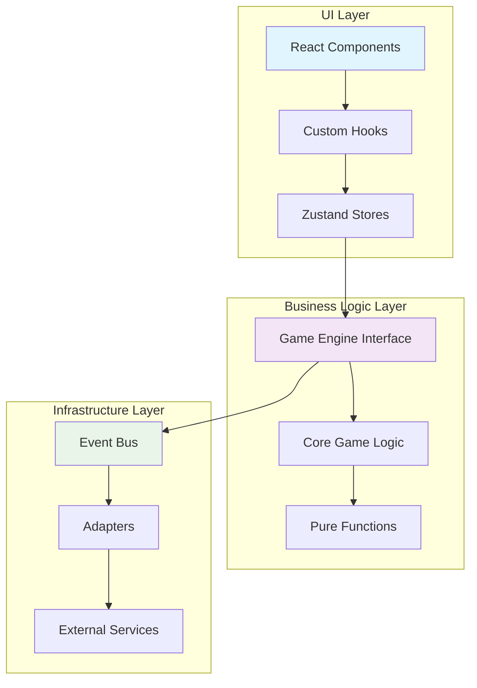

# Design Document

## Overview

このリファクタリング設計は、現在のTetrisプロジェクトの複雑性を削減し、将来の機能追加を容易にするシンプルで保守性の高いアーキテクチャへの移行を目指します。Feature-Sliced Design（FSD）の原則を維持しながら、以下の主要な改善を実装します：

1. **状態管理の簡素化** - Zustandストアの責任分離と最適化
2. **ゲームエンジンとUI層の明確な分離** - 依存関係の整理
3. **型安全性の向上** - Result型とtype guardsの活用
4. **パフォーマンス最適化** - レンダリングとメモリ使用量の改善
5. **テスタビリティの向上** - 純粋関数とDIパターンの活用

## Architecture

### 高レベルアーキテクチャ



### レイヤー責任

#### UI Layer
- **React Components**: プレゼンテーション層、UIロジックのみ
- **Custom Hooks**: UIとビジネスロジックの橋渡し
- **Zustand Stores**: UI状態管理、ビジネスロジックからの状態同期

#### Business Logic Layer
- **Game Engine Interface**: ゲームロジックの抽象化レイヤー
- **Core Game Logic**: ゲームルール、スコア計算、盤面操作
- **Pure Functions**: 副作用のない計算ロジック

#### Infrastructure Layer
- **Event Bus**: 非同期イベント処理
- **Adapters**: 外部システムとの統合
- **External Services**: AI、永続化、分析など

## Components and Interfaces

### 1. 簡素化されたゲームエンジン

```typescript
// 新しいシンプルなゲームエンジンインターフェース
interface SimpleGameEngine {
  // 状態アクセス（読み取り専用）
  readonly state: GameState;
  
  // アクション（副作用あり）
  actions: {
    move: (direction: Direction) => Result<void, GameError>;
    rotate: (direction: RotationDirection) => Result<void, GameError>;
    drop: (type: DropType) => Result<void, GameError>;
    hold: () => Result<void, GameError>;
    pause: () => void;
    reset: () => void;
  };
  
  // イベント（購読型）
  events: EventEmitter<GameEvents>;
}
```

### 2. 統一されたストア構造

```typescript
// 機能別ストアの統一インターフェース
interface FeatureStore<TState, TActions> {
  // 状態（読み取り専用）
  state: TState;
  
  // アクション（型安全）
  actions: TActions;
  
  // セレクター（最適化済み）
  selectors: Record<string, (state: TState) => unknown>;
  
  // サブスクリプション管理
  subscribe: (selector: (state: TState) => unknown) => UnsubscribeFn;
}
```

### 3. 型安全なイベントシステム

```typescript
// 型安全なイベント定義
type GameEvents = {
  'piece:moved': { direction: Direction; position: Position };
  'piece:rotated': { direction: RotationDirection; newRotation: RotationState };
  'piece:locked': { position: Position; linesCleared: number };
  'game:over': { finalScore: number; totalLines: number };
  'level:up': { newLevel: number; previousLevel: number };
};

// イベントバスの型安全な実装
interface TypedEventBus<TEvents> {
  emit<K extends keyof TEvents>(event: K, payload: TEvents[K]): void;
  on<K extends keyof TEvents>(event: K, handler: (payload: TEvents[K]) => void): UnsubscribeFn;
  once<K extends keyof TEvents>(event: K, handler: (payload: TEvents[K]) => void): UnsubscribeFn;
}
```

## Data Models

### 1. 不変データ構造

```typescript
// 不変なゲーム状態
interface ImmutableGameState {
  readonly board: ReadonlyArray<ReadonlyArray<CellValue>>;
  readonly currentPiece: Readonly<Tetromino> | null;
  readonly nextPieces: ReadonlyArray<TetrominoTypeName>;
  readonly score: number;
  readonly level: number;
  readonly lines: number;
  readonly isGameOver: boolean;
  readonly isPaused: boolean;
}

// 状態更新のためのビルダーパターン
interface GameStateBuilder {
  withBoard(board: GameBoard): GameStateBuilder;
  withCurrentPiece(piece: Tetromino | null): GameStateBuilder;
  withScore(score: number): GameStateBuilder;
  build(): ImmutableGameState;
}
```

### 2. Result型による エラーハンドリング

```typescript
// 統一されたResult型
type Result<T, E = GameError> = 
  | { ok: true; value: T }
  | { ok: false; error: E };

// Result型のユーティリティ
namespace ResultUtils {
  export const ok = <T>(value: T): Result<T> => ({ ok: true, value });
  export const err = <E>(error: E): Result<never, E> => ({ ok: false, error });
  export const map = <T, U, E>(result: Result<T, E>, fn: (value: T) => U): Result<U, E> => 
    result.ok ? ok(fn(result.value)) : result;
  export const flatMap = <T, U, E>(result: Result<T, E>, fn: (value: T) => Result<U, E>): Result<U, E> => 
    result.ok ? fn(result.value) : result;
}
```

### 3. 型ガードによる安全性

```typescript
// 型ガード関数
const isValidGameState = (state: unknown): state is GameState => {
  return (
    typeof state === 'object' &&
    state !== null &&
    'board' in state &&
    'score' in state &&
    typeof (state as GameState).score === 'number'
  );
};

// 型安全なデータアクセス
const safeGetGameState = (data: unknown): Result<GameState, ValidationError> => {
  if (isValidGameState(data)) {
    return ResultUtils.ok(data);
  }
  return ResultUtils.err(new ValidationError('Invalid game state'));
};
```

## Error Handling

### 1. 階層化されたエラー処理

```typescript
// エラー階層
abstract class GameError extends Error {
  abstract readonly code: string;
  abstract readonly recoverable: boolean;
}

class ValidationError extends GameError {
  readonly code = 'VALIDATION_ERROR';
  readonly recoverable = false;
}

class GameLogicError extends GameError {
  readonly code = 'GAME_LOGIC_ERROR';
  readonly recoverable = true;
}

class NetworkError extends GameError {
  readonly code = 'NETWORK_ERROR';
  readonly recoverable = true;
}
```

### 2. エラー回復戦略

```typescript
// エラー回復インターフェース
interface ErrorRecoveryStrategy {
  canRecover(error: GameError): boolean;
  recover(error: GameError, context: GameContext): Promise<Result<void, GameError>>;
}

// 具体的な回復戦略
class GameStateRecoveryStrategy implements ErrorRecoveryStrategy {
  canRecover(error: GameError): boolean {
    return error.recoverable && error.code === 'GAME_LOGIC_ERROR';
  }
  
  async recover(error: GameError, context: GameContext): Promise<Result<void, GameError>> {
    // ゲーム状態を安全な状態にリセット
    context.gameEngine.actions.reset();
    return ResultUtils.ok(undefined);
  }
}
```

### 3. エラー境界とフォールバック

```typescript
// React Error Boundary の改善
interface ErrorBoundaryState {
  hasError: boolean;
  error: Error | null;
  errorInfo: ErrorInfo | null;
  recoveryAttempts: number;
}

class EnhancedErrorBoundary extends Component<Props, ErrorBoundaryState> {
  private maxRecoveryAttempts = 3;
  
  static getDerivedStateFromError(error: Error): Partial<ErrorBoundaryState> {
    return { hasError: true, error };
  }
  
  componentDidCatch(error: Error, errorInfo: ErrorInfo) {
    // エラーログ記録
    this.logError(error, errorInfo);
    
    // 自動回復試行
    if (this.state.recoveryAttempts < this.maxRecoveryAttempts) {
      this.attemptRecovery();
    }
  }
}
```

## Testing Strategy

### 1. テスト構造の改善

```typescript
// テストユーティリティ
interface TestGameEngine {
  // テスト用のモック実装
  mockState: (state: Partial<GameState>) => void;
  mockAction: (action: string, result: Result<unknown, GameError>) => void;
  
  // アサーション
  expectState: (expected: Partial<GameState>) => void;
  expectEvent: (event: keyof GameEvents) => void;
}

// プロパティベーステスト
const gameLogicProperties = {
  // 盤面の整合性
  boardIntegrity: fc.property(
    fc.array(fc.array(fc.integer(0, 7), 10), 20),
    (board) => {
      const result = validateBoard(board);
      return result.ok || result.error.code === 'VALIDATION_ERROR';
    }
  ),
  
  // スコア計算の正確性
  scoreCalculation: fc.property(
    fc.integer(1, 4), // lines cleared
    fc.integer(1, 30), // level
    (lines, level) => {
      const score = calculateScore(lines, level);
      return score >= 0 && score <= MAX_POSSIBLE_SCORE;
    }
  )
};
```

### 2. モックとスタブの標準化

```typescript
// モックファクトリー
interface MockFactory {
  createGameEngine: (overrides?: Partial<GameEngine>) => MockGameEngine;
  createGameState: (overrides?: Partial<GameState>) => GameState;
  createTetromino: (type?: TetrominoTypeName) => Tetromino;
}

// テストデータビルダー
class GameStateBuilder {
  private state: Partial<GameState> = {};
  
  withScore(score: number): this {
    this.state.score = score;
    return this;
  }
  
  withLevel(level: number): this {
    this.state.level = level;
    return this;
  }
  
  build(): GameState {
    return { ...createInitialGameState(), ...this.state };
  }
}
```

### 3. 統合テストの改善

```typescript
// 統合テストシナリオ
describe('Game Integration Tests', () => {
  let gameEngine: GameEngine;
  let eventBus: TypedEventBus<GameEvents>;
  
  beforeEach(() => {
    gameEngine = createGameEngine();
    eventBus = createEventBus();
  });
  
  test('complete game flow', async () => {
    // ゲーム開始
    gameEngine.actions.reset();
    
    // 複数の操作を実行
    const moves = [
      () => gameEngine.actions.move('left'),
      () => gameEngine.actions.rotate('clockwise'),
      () => gameEngine.actions.drop('hard')
    ];
    
    for (const move of moves) {
      const result = move();
      expect(result.ok).toBe(true);
    }
    
    // 最終状態の検証
    expect(gameEngine.state.score).toBeGreaterThan(0);
  });
});
```

## Performance Optimizations

### 1. レンダリング最適化

```typescript
// メモ化されたセレクター
const createMemoizedSelector = <T, R>(
  selector: (state: T) => R,
  equalityFn?: (a: R, b: R) => boolean
) => {
  let lastState: T;
  let lastResult: R;
  
  return (state: T): R => {
    if (state !== lastState) {
      const newResult = selector(state);
      if (!equalityFn || !equalityFn(lastResult, newResult)) {
        lastResult = newResult;
      }
      lastState = state;
    }
    return lastResult;
  };
};

// 最適化されたZustandセレクター
const useOptimizedGameState = () => {
  return useGameStore(
    useShallow(
      createMemoizedSelector(
        (state) => ({
          score: state.score,
          level: state.level,
          lines: state.lines
        }),
        (a, b) => a.score === b.score && a.level === b.level && a.lines === b.lines
      )
    )
  );
};
```

### 2. メモリ管理

```typescript
// オブジェクトプールパターン
class TetrominoPool {
  private pool: Tetromino[] = [];
  private maxSize = 50;
  
  acquire(type: TetrominoTypeName): Tetromino {
    const tetromino = this.pool.pop();
    if (tetromino) {
      // 既存オブジェクトを再利用
      return this.resetTetromino(tetromino, type);
    }
    return createTetromino(type);
  }
  
  release(tetromino: Tetromino): void {
    if (this.pool.length < this.maxSize) {
      this.pool.push(tetromino);
    }
  }
}

// WeakMapを使用したキャッシュ
const calculationCache = new WeakMap<GameState, CalculationResult>();

const getCachedCalculation = (state: GameState): CalculationResult => {
  let result = calculationCache.get(state);
  if (!result) {
    result = performExpensiveCalculation(state);
    calculationCache.set(state, result);
  }
  return result;
};
```

### 3. 非同期処理の最適化

```typescript
// バッチ処理システム
class BatchProcessor<T> {
  private queue: T[] = [];
  private processing = false;
  private batchSize = 10;
  
  async add(item: T): Promise<void> {
    this.queue.push(item);
    
    if (!this.processing) {
      this.processing = true;
      await this.processBatch();
      this.processing = false;
    }
  }
  
  private async processBatch(): Promise<void> {
    while (this.queue.length > 0) {
      const batch = this.queue.splice(0, this.batchSize);
      await this.processBatchItems(batch);
      
      // フレーム予算を考慮した処理
      if (performance.now() % 16 > 14) {
        await new Promise(resolve => requestAnimationFrame(resolve));
      }
    }
  }
}
```

## Migration Strategy

### Phase 1: 基盤整備 (Week 1-2)
1. Result型とエラーハンドリングシステムの導入
2. 型ガード関数の実装
3. テストユーティリティの改善
4. 基本的なパフォーマンス最適化

### Phase 2: ストア統合 (Week 3-4)
1. Zustandストアの責任分離
2. セレクターの最適化
3. 状態同期メカニズムの改善
4. イベントシステムの型安全化

### Phase 3: ゲームエンジン改善 (Week 5-6)
1. ゲームエンジンインターフェースの簡素化
2. 純粋関数への分離
3. 依存性注入パターンの導入
4. AI統合の改善

### Phase 4: UI層最適化 (Week 7-8)
1. コンポーネントの責任分離
2. カスタムフックの最適化
3. レンダリングパフォーマンスの改善
4. アクセシビリティの向上

### Phase 5: 統合とテスト (Week 9-10)
1. 統合テストの実装
2. パフォーマンステストの実行
3. ドキュメントの更新
4. 最終的な最適化とクリーンアップ